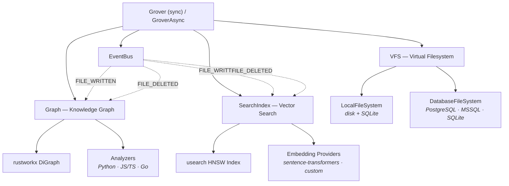

[](https://pypi.org/project/grover/)
[](https://pypi.org/project/grover/)
[](https://github.com/ClayGendron/grover/blob/main/LICENSE)

# Grover

**The agentic filesystem.** Safe file operations, knowledge graphs, and semantic search — unified for AI agents.

> **Alpha** — Grover is under active development. The core API is functional and tested, but expect breaking changes before 1.0.

Grover gives AI agents a single toolkit for working with codebases and documents:

- **Versioned filesystem** — mount local directories or databases, write safely with automatic versioning, and recover mistakes with soft-delete trash and rollback.
- **Knowledge graph** — dependency, impact, and containment queries powered by [rustworkx](https://github.com/Qiskit/rustworkx). Code is automatically analyzed (Python via AST; JS/TS/Go via tree-sitter) and wired into the graph.
- **Semantic search** — HNSW vector index via [usearch](https://github.com/unum-cloud/usearch) with pluggable embedding providers. Search by meaning, not just keywords.

All three layers stay in sync — write a file and the graph rebuilds and embeddings re-index automatically.

The name comes from **grove** (a connected cluster of trees) + **rover** (an agent that explores). Grover treats your codebase as a grove of interconnected files and lets agents navigate it safely.

## Installation

```bash
pip install grover
```

Optional extras:

```bash
pip install grover[search]       # sentence-transformers + usearch
pip install grover[treesitter]   # JS/TS/Go code analyzers
pip install grover[postgres]     # PostgreSQL backend
pip install grover[mssql]        # MSSQL backend
pip install grover[all]          # search + treesitter + postgres
```

Requires Python 3.12+.

## Quick start

```python
from grover import Grover
from grover.fs import LocalFileSystem

# Create a Grover instance (state is stored in .grover/)
g = Grover()

# Mount a local project directory
backend = LocalFileSystem(workspace_dir="/path/to/project")
g.mount("/project", backend)

# Write files — every write is automatically versioned
g.write("/project/hello.py", "def greet(name):\n    return f'Hello, {name}!'\n")
g.write("/project/main.py", "from hello import greet\nprint(greet('world'))\n")

# Read, edit, delete
content = g.read("/project/hello.py")
g.edit("/project/hello.py", "Hello", "Hi")
g.delete("/project/main.py")  # soft-delete — recoverable from trash

# Index the project (analyze code, build graph + search index)
stats = g.index()
# {"files_scanned": 42, "chunks_created": 187, "edges_added": 95}

# Knowledge graph queries
g.dependencies("/project/main.py")   # what does main.py depend on?
g.dependents("/project/hello.py")    # what depends on hello.py?
g.impacts("/project/hello.py")       # transitive impact analysis
g.contains("/project/hello.py")      # functions and classes inside

# Semantic search (requires the search extra)
results = g.search("greeting function", k=5)
for r in results:
    print(r.ref.path, r.score)

# Persist and clean up
g.save()
g.close()
```

A full async API is also available:

```python
from grover import GroverAsync

g = GroverAsync()
await g.mount("/project", backend)
await g.write("/project/hello.py", "...")
await g.save()
await g.close()
```

## Architecture

Grover is composed of three layers that share a common identity model — every node in the graph and every entry in the search index is a file path.



**VFS** routes operations to the right backend based on mount paths. Multiple backends can be mounted simultaneously.

**Graph** maintains an in-memory directed graph of file dependencies. Code analyzers automatically extract imports, function definitions, and class hierarchies. You can also add manual edges.

**SearchIndex** embeds file chunks into vectors and serves similarity queries. The default provider uses `all-MiniLM-L6-v2` (80 MB, runs on CPU, no API key needed).

**EventBus** keeps everything consistent — when a file is written or deleted, the graph and search index update automatically.

## Backends

Grover supports two storage backends through a common protocol:

**LocalFileSystem** — for desktop development and code editing. Files live on disk where your IDE, git, and other tools can see them. Metadata and version history are stored in a local SQLite database. This is the default for local projects.

**DatabaseFileSystem** — for web applications and shared knowledge bases. All content lives in the database (PostgreSQL, MSSQL, or SQLite). There are no physical files. This is ideal for multi-tenant platforms, enterprise document stores, or any environment where state should be centralized.

Both backends support versioning and trash. You can mount them side by side:

```python
from grover.fs import LocalFileSystem, DatabaseFileSystem

g = Grover()

# Local code on disk
g.mount("/code", LocalFileSystem(workspace_dir="./my-project"))

# Shared docs in PostgreSQL
g.mount("/docs", DatabaseFileSystem(dialect="postgresql"))
```

### Authenticated mounts

For multi-tenant deployments, mount with `authenticated=True` to enable per-user namespacing:

```python
g = GroverAsync()
await g.mount("/ws", engine=engine, authenticated=True)

# Each user has their own namespace
await g.write("/ws/notes.md", "hello", user_id="alice")
await g.write("/ws/notes.md", "world", user_id="bob")
r1 = await g.read("/ws/notes.md", user_id="alice")  # "hello"
r2 = await g.read("/ws/notes.md", user_id="bob")    # "world"

# Share files between users
await g.share("/ws/notes.md", "bob", user_id="alice")
r3 = await g.read("/ws/@shared/alice/notes.md", user_id="bob")  # "hello"
```

## What's in `.grover/`

When you use Grover, a `.grover/` directory is created to store internal state:

| Path | Contents |
|------|----------|
| `grover.db` | SQLite database with file metadata, version history, and graph edges |
| `chunks/` | Extracted code chunks (functions, classes) as individual files |
| `search.usearch` | The HNSW vector index for semantic search |
| `search_meta.json` | Metadata mapping for the search index |

This directory is excluded from indexing automatically. You'll typically want to add `.grover/` to your `.gitignore`.

## API overview

The full API reference is in [`docs/api.md`](docs/api.md). Here's a summary:

| Category | Methods |
|----------|---------|
| **Filesystem** | `read`, `write`, `edit`, `delete`, `list_dir`, `exists`, `move`, `copy` |
| **Versioning** | `list_versions`, `get_version_content`, `restore_version` |
| **Trash** | `list_trash`, `restore_from_trash`, `empty_trash` |
| **Sharing** | `share`, `unshare`, `list_shares`, `list_shared_with_me` |
| **Graph** | `dependencies`, `dependents`, `impacts`, `path_between`, `contains` |
| **Search** | `search` |
| **Lifecycle** | `mount`, `unmount`, `index`, `save`, `close` |

Key types:

```python
from grover import Ref, SearchResult, file_ref

# Ref — immutable reference to a file or chunk
Ref(path="/project/hello.py", version=2, line_start=1, line_end=5)

# SearchResult — a search hit with similarity score
result.ref       # Ref
result.score     # float (cosine similarity, 0–1)
result.content   # str
```

## Roadmap

Grover is in its first release cycle. Here's what's coming:

- **MCP server** — expose Grover as a Model Context Protocol server for Claude Code, Cursor, and other MCP-compatible agents
- **CLI** — `grover init`, `grover status`, `grover search`, `grover rollback`
- **Framework integrations** — LangGraph tools, Aider plugin, fsspec adapter
- **More language analyzers** — Rust, Java, C#
- **More embedding providers** — OpenAI, Cohere, Voyage

See the [implementation plan](grover_implementation_plan.md) for the full roadmap.

## Contributing

Contributions are welcome! See [CONTRIBUTING.md](CONTRIBUTING.md) for development setup, workflow, and guidelines.

## License

[Apache-2.0](LICENSE)
