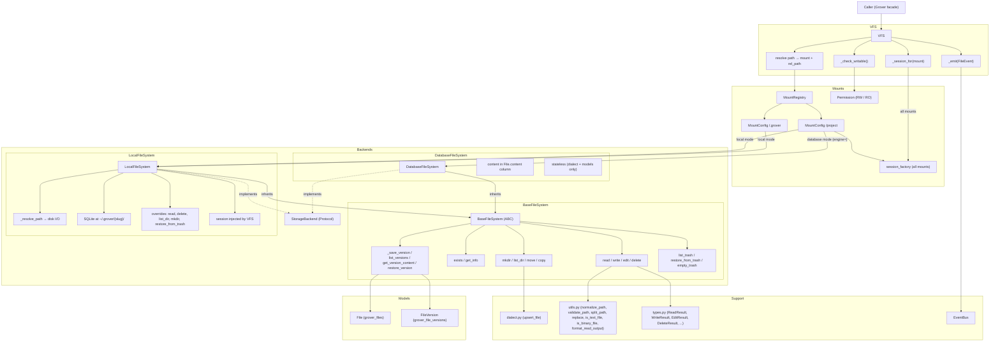
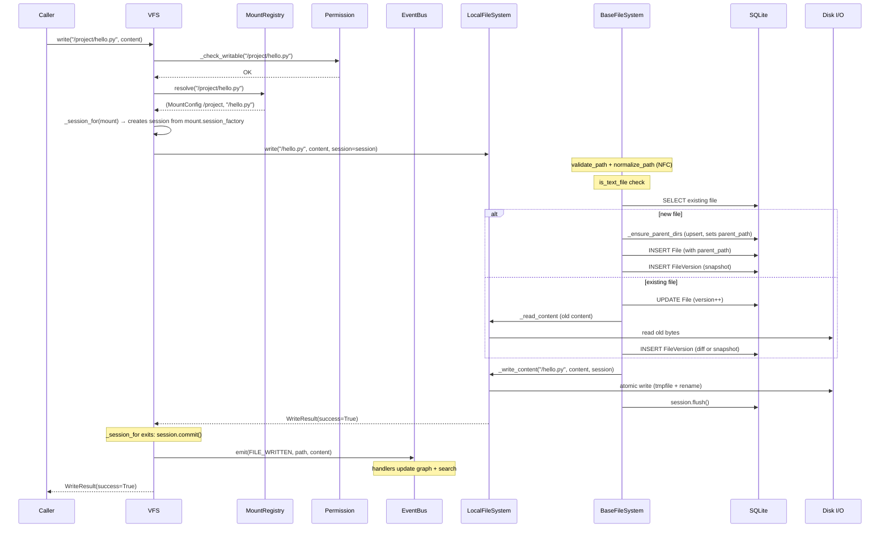
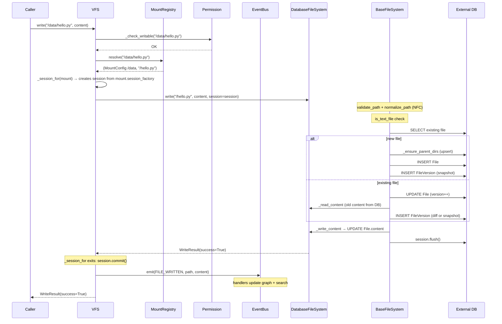
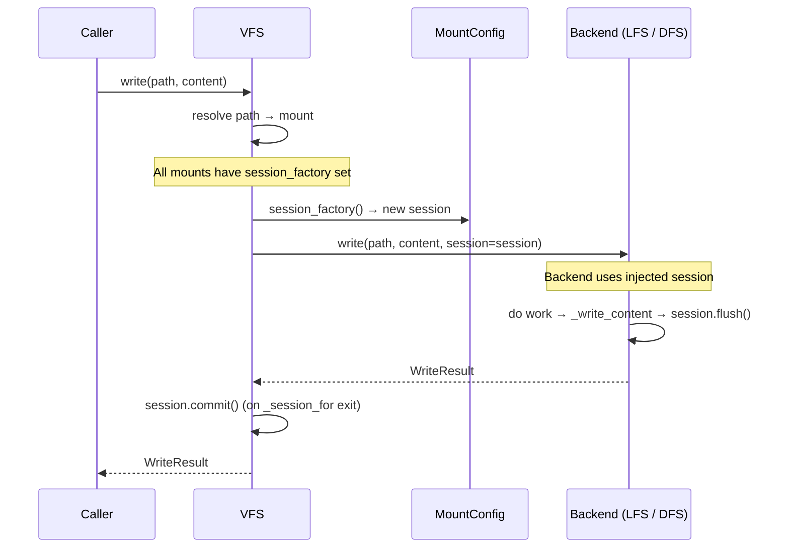
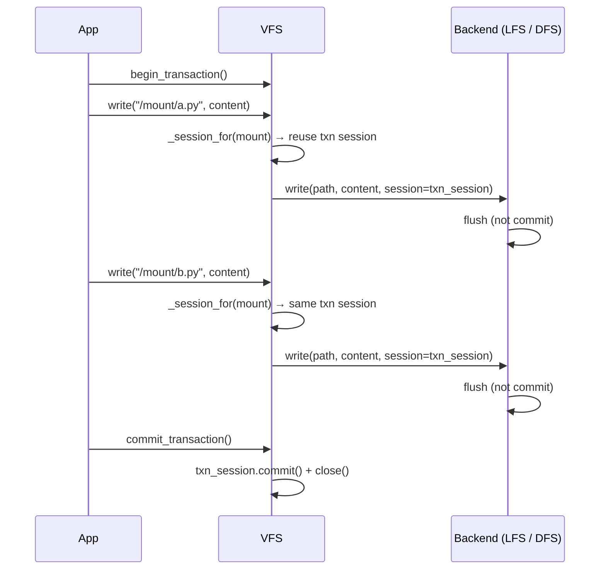
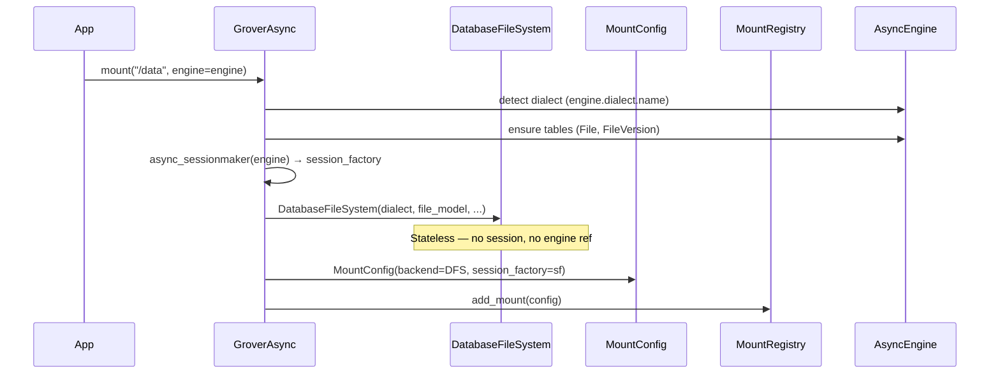
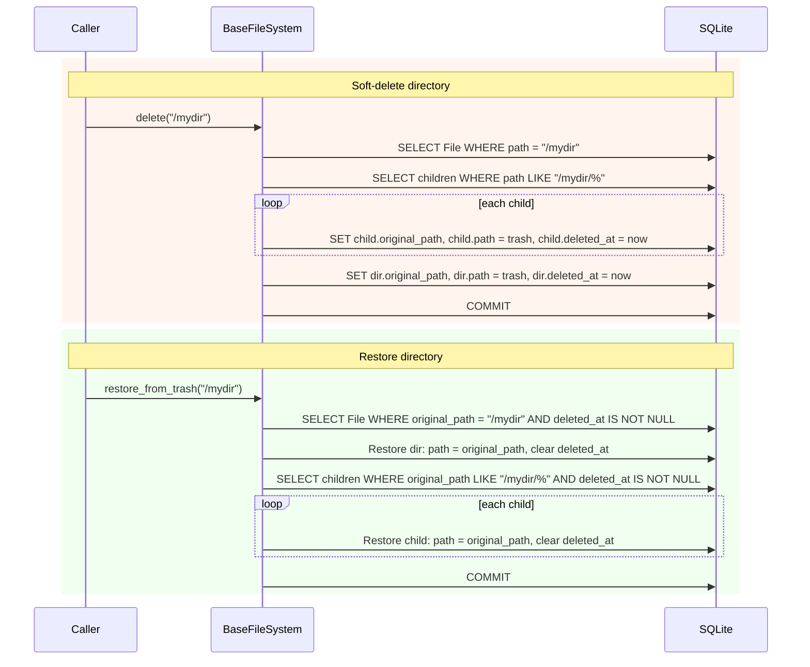
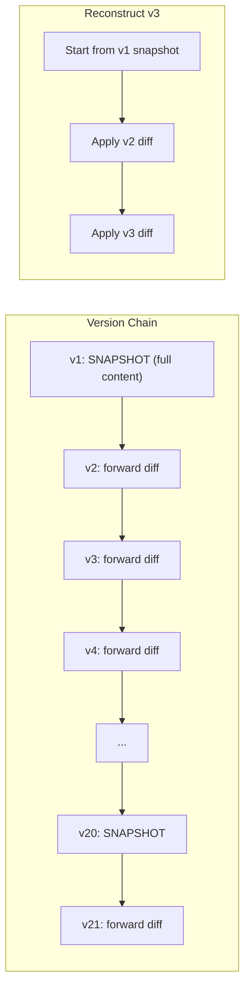
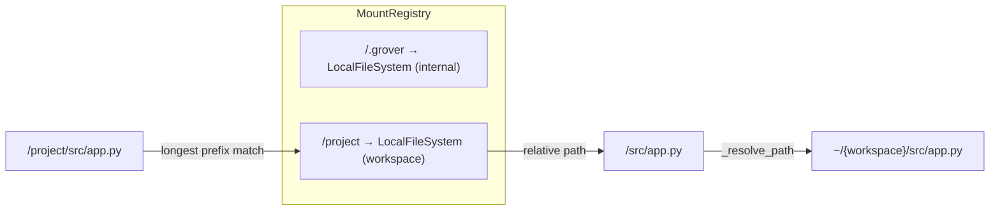
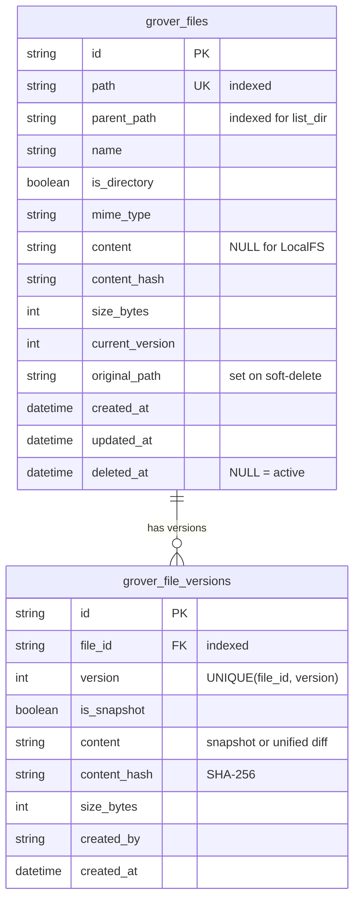

# Filesystem Architecture

## Component Relationships

**DB mounts** are created via `engine=` or `session_factory=` on `GroverAsync.mount()`. The engine form auto-creates a session factory, detects the SQL dialect, and ensures tables exist. This produces a stateless `DatabaseFileSystem` instance (immutable config only — dialect, file model, schema) paired with a `session_factory` stored on `MountConfig`. VFS creates sessions from the factory per-operation and passes them to DFS via `session=`.

## Request Flow: `write("/project/hello.py", content)` — Local Mount

## Request Flow: `write("/data/hello.py", content)` — DB Mount

## Session Lifecycle

Sessions are managed by VFS and injected into backends.

### Transaction Mode

In transaction mode (`async with grover:`), VFS reuses sessions per mount across operations for all mount types (local and DB). The commit happens on context-manager exit rather than after each operation.

## DB Mount Setup: `engine=` API

## Soft-Delete / Restore (Directories)

## Versioning Strategy

Snapshots are stored every 20 versions (`SNAPSHOT_INTERVAL = 20`) and always for version 1. A `UniqueConstraint("file_id", "version")` prevents duplicate version records. Content integrity is verified via SHA-256 hash on reconstruction.

## Mount Resolution

## Database Schema

## SQLite Pragmas (LocalFileSystem)

| Pragma | Value | Purpose |
|--------|-------|---------|
| `journal_mode` | `WAL` | Concurrent reads during writes; verified on connect |
| `synchronous` | `FULL` | Durability — fsync on every commit |
| `busy_timeout` | `5000` | Wait 5s on contention instead of immediate SQLITE_BUSY |
| `foreign_keys` | `ON` | Enforce FK constraints |
