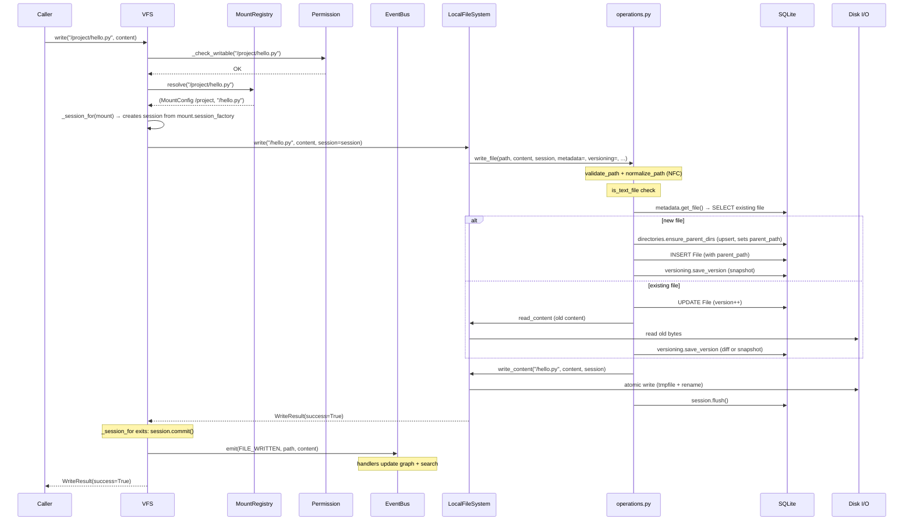
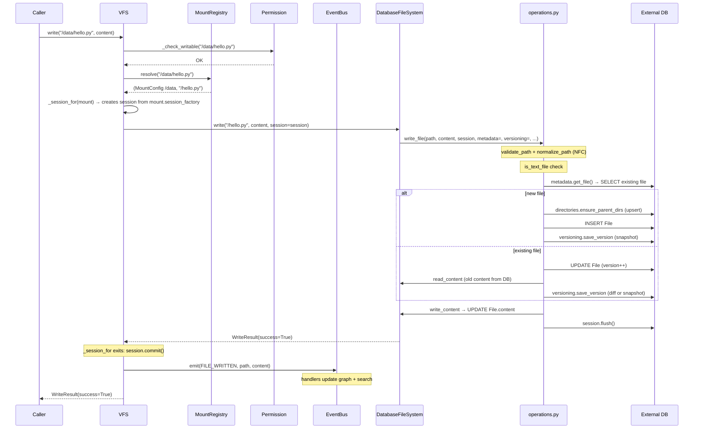
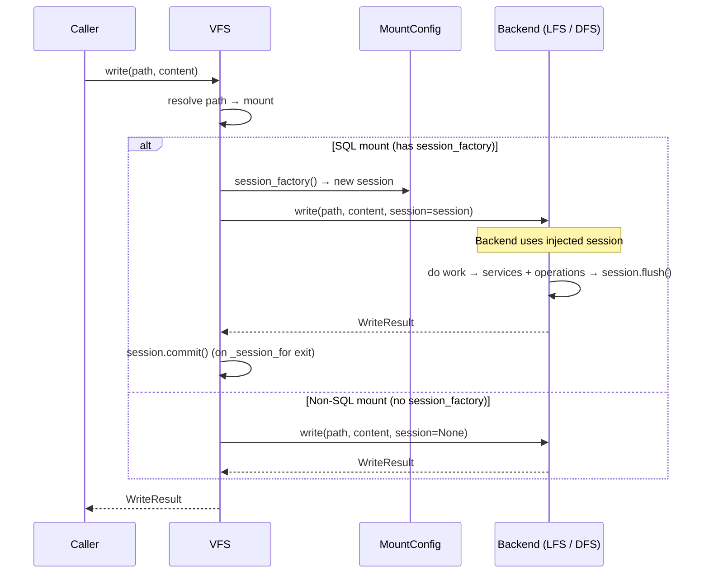
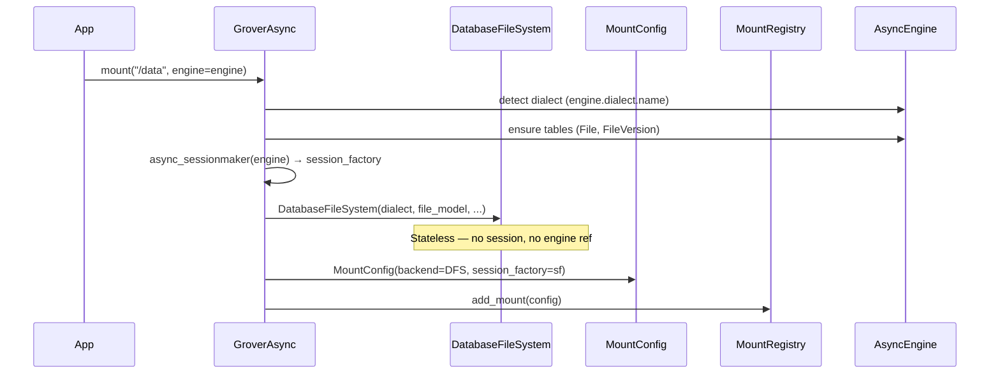
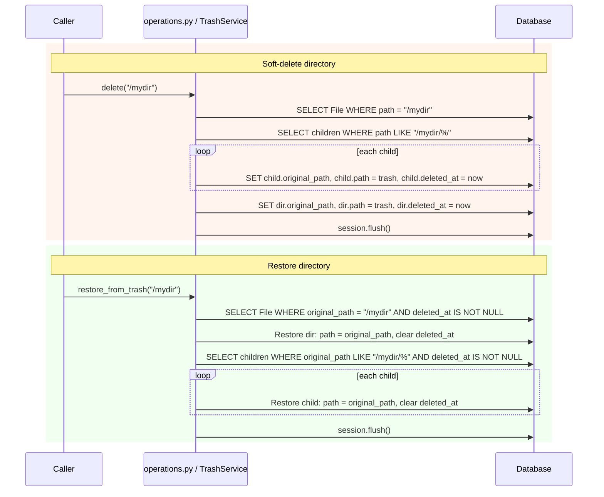
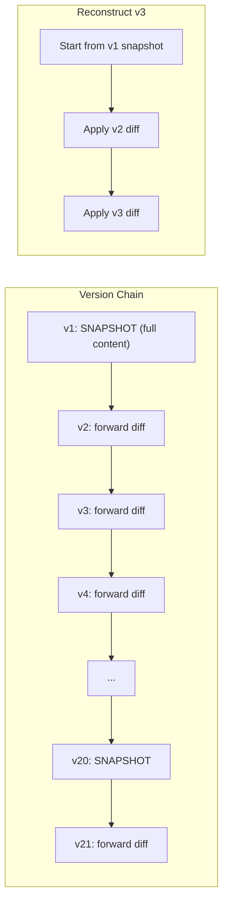
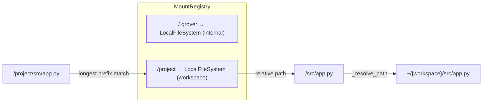
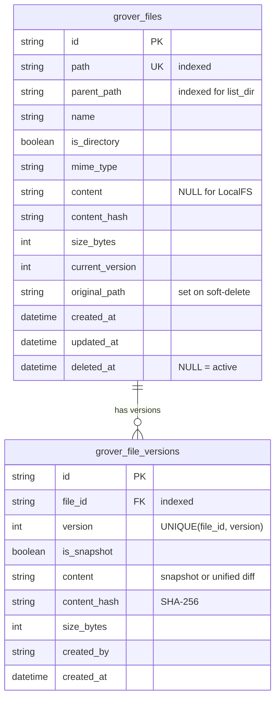

# Filesystem Architecture

## Component Relationships

```mermaid
graph TD
    Caller["Caller (Grover facade)"]

    subgraph VFS
        UFS["VFS"]
        UFS_perm["_check_writable()"]
        UFS_route["resolve path → mount + rel_path"]
        UFS_session["_session_for(mount)"]
        UFS_emit["_emit(FileEvent)"]
        UFS_cap["_get_capability(backend, protocol)"]
    end

    subgraph Mounts
        MR["MountRegistry"]
        MC_proj["MountConfig /project"]
        MC_grover["MountConfig /.grover"]
        MC_sf["session_factory (SQL mounts)"]
        Perm["Permission (RW / RO)"]
    end

    subgraph Services
        Meta["MetadataService"]
        Ver["VersioningService"]
        Dir["DirectoryService"]
        Trash["TrashService"]
    end

    subgraph Operations
        Ops["operations.py"]
        Ops_write["write_file()"]
        Ops_edit["edit_file()"]
        Ops_delete["delete_file()"]
        Ops_move["move_file()"]
        Ops_copy["copy_file()"]
    end

    subgraph Backends
        Proto["StorageBackend (Protocol)"]
        CapVer["SupportsVersions (Protocol)"]
        CapTrash["SupportsTrash (Protocol)"]
        CapRecon["SupportsReconcile (Protocol)"]

        subgraph LocalFileSystem
            LFS["LocalFileSystem"]
            LFS_disk["_resolve_path → disk I/O"]
            LFS_db["SQLite at data_dir/"]
            LFS_session["session injected by VFS"]
        end

        subgraph DatabaseFileSystem
            DFS["DatabaseFileSystem"]
            DFS_content["content in File.content column"]
            DFS_session["stateless (dialect + models only)"]
        end
    end

    subgraph Models
        GF["File (grover_files)"]
        FV["FileVersion (grover_file_versions)"]
    end

    subgraph Support
        Dialect["dialect.py (upsert_file)"]
        Utils["utils.py (normalize_path, validate_path, ...)"]
        Types["types.py (ReadResult, WriteResult, ...)"]
        EB["EventBus"]
    end

    Caller --> UFS
    UFS --> UFS_perm --> Perm
    UFS --> UFS_route --> MR
    UFS --> UFS_session
    UFS --> UFS_cap
    MR --> MC_proj
    MR --> MC_grover

    MC_proj -->|"local mode"| LFS
    MC_grover -->|"local mode"| LFS
    MC_proj -->|"database mode (engine=)"| DFS
    MC_proj --> MC_sf

    UFS_session -->|"SQL mounts"| MC_sf

    UFS --> UFS_emit --> EB

    LFS -.implements.-> Proto
    LFS -.implements.-> CapVer
    LFS -.implements.-> CapTrash
    LFS -.implements.-> CapRecon
    DFS -.implements.-> Proto
    DFS -.implements.-> CapVer
    DFS -.implements.-> CapTrash

    LFS -->|composes| Meta
    LFS -->|composes| Ver
    LFS -->|composes| Dir
    LFS -->|composes| Trash
    DFS -->|composes| Meta
    DFS -->|composes| Ver
    DFS -->|composes| Dir
    DFS -->|composes| Trash

    LFS -->|delegates to| Ops
    DFS -->|delegates to| Ops

    Ops --> Ops_write
    Ops --> Ops_edit
    Ops --> Ops_delete
    Ops --> Ops_move
    Ops --> Ops_copy
    Ops --> Utils
    Ops --> Types

    Meta --> GF
    Ver --> FV
    Dir --> Dialect
```



**No base class.** Both `LocalFileSystem` and `DatabaseFileSystem` implement the `StorageBackend` protocol directly, composing shared services (`MetadataService`, `VersioningService`, `DirectoryService`, `TrashService`) and delegating to standalone orchestration functions in `operations.py`.

**DB mounts** are created via `engine=` or `session_factory=` on `GroverAsync.mount()`. The engine form auto-creates a session factory, detects the SQL dialect, and ensures tables exist. This produces a stateless `DatabaseFileSystem` instance (immutable config only — dialect, file model, schema) paired with a `session_factory` stored on `MountConfig`. VFS creates sessions from the factory per-operation and passes them to DFS via `session=`.

## Capability Protocols

Backends implement the core `StorageBackend` protocol plus optional capability protocols:

```
StorageBackend (core — 12 methods)
    session: AsyncSession | None = None on all methods
├── SupportsVersions (opt-in — 3 methods)
│     list_versions, get_version_content, restore_version
├── SupportsTrash (opt-in — 3 methods)
│     list_trash, restore_from_trash, empty_trash
└── SupportsReconcile (opt-in — 1 method)
      reconcile
```

VFS uses `isinstance(backend, protocol)` to check capabilities at runtime. Behavior for unsupported capabilities:

| VFS Method | Capability | Unsupported Behavior |
|-----------|-----------|---------------------|
| `list_versions(path)` | `SupportsVersions` | Raise `CapabilityNotSupportedError` |
| `get_version_content(path, ver)` | `SupportsVersions` | Raise `CapabilityNotSupportedError` |
| `restore_version(path, ver)` | `SupportsVersions` | Raise `CapabilityNotSupportedError` |
| `list_trash()` | `SupportsTrash` | Skip mount silently (aggregation) |
| `restore_from_trash(path)` | `SupportsTrash` | Raise `CapabilityNotSupportedError` |
| `empty_trash()` | `SupportsTrash` | Skip mount silently (aggregation) |
| `delete(permanent=False)` | No `SupportsTrash` | `DeleteResult(success=False)` |

`GroverAsync` catches `CapabilityNotSupportedError` and returns `Result(success=False)` — the agent loop always gets Results, never unhandled exceptions.

## Request Flow: `write("/project/hello.py", content)` — Local Mount



## Request Flow: `write("/data/hello.py", content)` — DB Mount



## Session Lifecycle

Sessions are managed by VFS and injected into backends. Every operation creates, uses, commits, and closes its own session.



Non-SQL backends receive `session=None` and handle storage independently. SQL backends **fail fast** if session is None.

## Explicit Lifecycle (`open` / `close`)

Backends define `open()` and `close()` methods instead of context managers:

- `open()` — Called at mount time. LocalFS initializes its SQLite engine. DFS is a no-op.
- `close()` — Called on unmount/shutdown. LocalFS disposes its SQLite engine. DFS is a no-op.
- VFS `close()` calls `backend.close()` on all mounts.

There are no `__aenter__`/`__aexit__` methods on VFS, GroverAsync, or Grover.

## DB Mount Setup: `engine=` API



## Soft-Delete / Restore (Directories)



## Versioning Strategy



Snapshots are stored every 20 versions (`SNAPSHOT_INTERVAL = 20`) and always for version 1. A `UniqueConstraint("file_id", "version")` prevents duplicate version records. Content integrity is verified via SHA-256 hash on reconstruction.

## Composition Stack

```
Services (stateful, hold model refs, receive session per-call):
  metadata.py    — MetadataService (get_file, exists, get_info, file_to_info)
  versioning.py  — VersioningService (save_version, delete_versions, list_versions, get_version_content)
  directories.py — DirectoryService (ensure_parent_dirs, mkdir)
  trash.py       — TrashService (list_trash, restore_from_trash, empty_trash)

Orchestration (stateless functions):
  operations.py  — write_file(), edit_file(), delete_file(), move_file(), copy_file(), list_dir_db()
                   Takes services + content callbacks as parameters.

Concrete Backends (no base class, implement protocol directly):
  LocalFileSystem    — composes all services + operations, owns disk I/O
  DatabaseFileSystem — composes all services + operations, content in DB
```

## Mount Resolution



## Database Schema



## SQLite Pragmas (LocalFileSystem)

| Pragma | Value | Purpose |
|--------|-------|---------|
| `journal_mode` | `WAL` | Concurrent reads during writes; verified on connect |
| `synchronous` | `FULL` | Durability — fsync on every commit |
| `busy_timeout` | `5000` | Wait 5s on contention instead of immediate SQLITE_BUSY |
| `foreign_keys` | `ON` | Enforce FK constraints |
