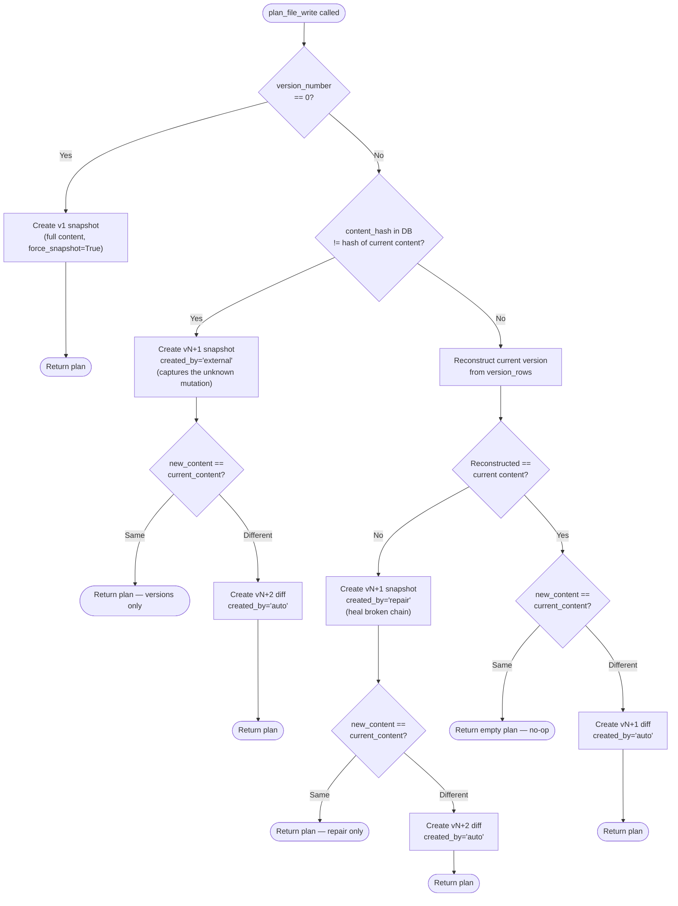

# DatabaseFileSystem._write_impl — Deep Dive

This document walks through every step of `_write_impl` in
`src/grover/backends/database.py` with concrete data examples and a
flow diagram.

---

## Running Example

We'll trace a single batch write call through all six steps:

```python
await db.write(objects=[
    GroverObject(path="/src/auth.py",              content="def login(): pass"),
    GroverObject(path="/src/auth.py/.chunks/login", content="def login(): pass"),
    GroverObject(path="/src/utils.py",             content="# utils v2"),
])
```

Assume the database already contains:

| path | kind | content | version_number | deleted_at |
|---|---|---|---|---|
| `/src` | directory | NULL | NULL | NULL |
| `/src/utils.py` | file | `# utils v1` | 1 | NULL |
| `/src/utils.py/.versions/1` | version | `# utils v1` | 1 | NULL |

So `/src/auth.py` is **new**, `/src/utils.py` is an **overwrite**, and
the chunk's parent file is in the same batch.

---

## Flow Diagram

```mermaid
flowchart TD
    START([write called]) --> NORM

    subgraph STEP1["Step 1 — Validate"]
        NORM[Normalize input into object list]
        NORM --> KIND{Each obj.kind<br/>file or chunk?}
        KIND -- No --> ERR1[Append error,<br/>skip object]
        KIND -- Yes --> DUP{Duplicate<br/>path?}
        DUP -- Yes --> FAIL1[Return failure<br/>immediately]
        DUP -- No --> MAP[Add to write_map]
    end

    MAP --> STEP2

    subgraph STEP2["Step 2 — Validate Chunk Parents"]
        CP_FIND[Find chunks whose parent_path<br/>is NOT in write_map]
        CP_FIND --> CP_QUERY[Query DB for parent files<br/>with kind='file']
        CP_QUERY --> CP_CHECK{Parent exists<br/>in DB or batch?}
        CP_CHECK -- No --> CP_ERR[Mark path invalid,<br/>append error]
        CP_CHECK -- Yes --> CP_OK[Chunk validated]
    end

    CP_OK --> STEP3
    CP_ERR --> ALL_INVALID{All paths<br/>invalid?}
    ALL_INVALID -- Yes --> FAIL2[Return failure]
    ALL_INVALID -- No --> STEP3

    subgraph STEP3["Step 3 — Resolve Parent Dirs"]
        DIR_WALK[Walk ancestor paths<br/>for each file write]
        DIR_WALK --> DIR_QUERY[Query ALL existing objects<br/>at ancestor paths — any kind]
        DIR_QUERY --> DIR_KIND{Each ancestor<br/>is a directory?}
        DIR_KIND -- No --> DIR_ERR[Return error:<br/>'not directory']
        DIR_KIND -- Yes --> DIR_REVIVE[Collect soft-deleted dirs<br/>for revival]
        DIR_REVIVE --> DIR_NEW[Create GroverObject<br/>for missing dirs]
        DIR_NEW --> DIR_DEFER[Hold in parent_dirs list<br/>— NOT added to session yet]
    end

    DIR_DEFER --> STEP4
    DIR_ERR --> FAIL3[Return failure]

    subgraph STEP4["Step 4 — Fetch Existing + Versions"]
        FETCH_QUERY["Single query per batch:<br/>WHERE path IN (batch)<br/>OR (kind='version'<br/>AND parent_path IN (batch)<br/>AND version_number + 10 >= file.version_number)"]
        FETCH_QUERY --> FETCH_SPLIT{Route each row}
        FETCH_SPLIT -- "path in write_map" --> EXISTING[existing_map]
        FETCH_SPLIT -- "kind='version'" --> VERSIONS[versions_map]
    end

    VERSIONS --> STEP5
    EXISTING --> STEP5

    subgraph STEP5["Step 5 — Process Writes"]
        SAVEPOINT[begin_nested — savepoint]
        SAVEPOINT --> EXISTS{Object exists<br/>in existing_map?}
        EXISTS -- Yes --> DELETED{Was it<br/>soft-deleted?}
        DELETED -- "No, overwrite=False" --> SKIP[Append error,<br/>continue]
        DELETED -- "Yes or overwrite=True" --> FILEKIND{kind == file<br/>and has content?}
        FILEKIND -- Yes --> PLAN["plan_file_write()<br/>detect external/repair,<br/>create version rows"]
        FILEKIND -- No --> UPDATE["update_content()<br/>— chunk or content-less"]
        PLAN --> APPLY["apply_write_plan()<br/>+ session.add version rows"]
        EXISTS -- No --> NEW_FILE{kind == file<br/>with content?}
        NEW_FILE -- Yes --> CREATE_V1["create_version_row(v1, snapshot)<br/>session.add(version)<br/>session.add(file)"]
        NEW_FILE -- No --> ADD_ONLY["session.add(object)"]
        APPLY --> CAND[Append to batch_out]
        UPDATE --> CAND
        CREATE_V1 --> CAND
        ADD_ONLY --> CAND
        CAND --> FLUSH["await session.flush()"]
        FLUSH -- Error --> ROLLBACK[Savepoint rolled back,<br/>errors appended]
        FLUSH -- OK --> EXTEND[Extend out list]
    end

    EXTEND --> STEP6
    ROLLBACK --> STEP6

    subgraph STEP6["Step 6 — Commit Parent Dirs"]
        HAS_OUT{Any successful<br/>writes in out?}
        HAS_OUT -- No --> DONE
        HAS_OUT -- Yes --> DIR_BATCH[For each parent dir batch]
        DIR_BATCH --> DIR_SAVE[begin_nested savepoint]
        DIR_SAVE --> DIR_TYPE{Revived or new?}
        DIR_TYPE -- "deleted_at is not None" --> REVIVE["Clear deleted_at,<br/>set updated_at"]
        DIR_TYPE -- "New object" --> ADD_DIR["session.add(dir)"]
        REVIVE --> DIR_FLUSH["await session.flush()"]
        ADD_DIR --> DIR_FLUSH
        DIR_FLUSH -- Error --> DIR_ERR2[Append error]
        DIR_FLUSH -- OK --> DONE
    end

    DONE([Return GroverResult])
```



---

## Step-by-Step with Concrete Data

### Step 1 — Validate

**Code:** lines 363-383

The entry point accepts either `(path, content)` or `objects`. A single
`path`/`content` call is immediately wrapped into a one-element list so
every write takes the batch path:

```python
# Single write gets normalized:
#   write("/src/auth.py", "def login(): pass")
# becomes:
objects = [self._model(path="/src/auth.py", content="def login(): pass")]
```

The model validator (`_normalize_and_derive`) fires during `__init__` and
derives `kind`, `parent_path`, `name`, `content_hash`, `size_bytes`, and
`lines` from the path and content.

After construction, each object is checked:

```
write_map = {}

# Object 1: /src/auth.py
#   kind = "file" (has .py extension)   -> OK
#   path not in write_map               -> OK
#   write_map["/src/auth.py"] = <obj>

# Object 2: /src/auth.py/.chunks/login
#   kind = "chunk" (/.chunks/ marker)   -> OK
#   path not in write_map               -> OK
#   write_map["/src/auth.py/.chunks/login"] = <obj>

# Object 3: /src/utils.py
#   kind = "file"                       -> OK
#   path not in write_map               -> OK
#   write_map["/src/utils.py"] = <obj>
```

What gets rejected here:
- **Version paths** like `/file.txt/.versions/3` (kind = `"version"`)
- **Connection paths** like `/a.py/.connections/imports/b.py` (kind = `"connection"`)
- **Duplicate paths** in the same batch (immediate hard failure — not a partial skip)

### Step 2 — Validate Chunk Parents

**Code:** lines 385-389 (calls `_validate_chunk_parents` at line 186)

Chunks are metadata children of files. A chunk write is only valid if its
parent file either (a) already exists in the database or (b) is included
in the same write batch.

```
Chunk writes in batch:  ["/src/auth.py/.chunks/login"]

# login's parent_path = "/src/auth.py"
# Is "/src/auth.py" in write_map?  YES -> skip DB check

# Result: no invalid chunks
invalid_chunk_paths = {}
```

If we had instead written *only* the chunk without its parent file:

```python
await db.write("/ghost.py/.chunks/login", "def login():")
# parent_path = "/ghost.py"
# "/ghost.py" not in write_map -> query DB
# DB has no /ghost.py -> ERROR: "Chunk parent file not found: /ghost.py"
```

### Step 3 — Resolve Parent Dirs

**Code:** lines 391-398 (calls `_resolve_parent_dirs` at line 122)

For every **file** in the batch (chunks are skipped — their parent is a
file, not a directory), walk up the path to collect ancestor directories:

```
File paths: ["/src/auth.py", "/src/utils.py"]

# /src/auth.py -> parent "/src" -> parent "/"  (stop at root)
# /src/utils.py -> parent "/src" (already seen) -> stop

all_ancestors = {"/src"}
```

Query the DB for `/src` — **without a kind filter** so we can detect
if something non-directory is sitting at an ancestor path:

```sql
SELECT * FROM grover_objects WHERE path IN ('/src')
```

Result: `{"/src": <directory, deleted_at=NULL>}`

Since `/src` exists, is a directory, and is not soft-deleted, there's
nothing to do. `parent_dirs = []`.

**What this prevents:** If `/src` were a *file* instead of a directory,
the write would fail with `"Ancestor path exists as file, not directory: /src"`.

**What about a deeper new path?** If we were writing `/brand_new/deep/file.py`:

```
all_ancestors = {"/brand_new", "/brand_new/deep"}

# DB query returns nothing for either
# -> Create two new GroverObject(kind="directory") instances
# -> Sorted shallowest-first: ["/brand_new", "/brand_new/deep"]
# -> Stored in parent_dirs list but NOT added to session yet
```

The deferral is critical: if Step 5 fails, these dirs never get committed
(no phantom directories in the DB).

### Step 4 — Fetch Existing Objects and Bounded Version Chains

**Code:** lines 400-429

This is the most complex query. It fetches two things in a single
`SELECT ... WHERE ... OR ...`:

1. **Existing objects** at the paths we're writing to (including
   soft-deleted — needed for revival)
2. **Recent version rows** for files being overwritten (bounded to only
   the versions needed for reconstruction)

```sql
SELECT * FROM grover_objects
WHERE
    path IN ('/src/auth.py', '/src/auth.py/.chunks/login', '/src/utils.py')
  OR (
    kind = 'version'
    AND parent_path IN ('/src/auth.py', '/src/auth.py/.chunks/login', '/src/utils.py')
    AND version_number + 10 >= (
        SELECT f.version_number
        FROM grover_objects f
        WHERE f.path = grover_objects.parent_path
    )
  )
```

The `version_number + SNAPSHOT_INTERVAL >= file.version_number` bound is
the key optimization. With `SNAPSHOT_INTERVAL = 10`, if a file is at
version 25, we only fetch versions 16-25 (at most). We're guaranteed to
have a snapshot somewhere in that range because snapshots happen every 10
versions. This avoids loading the entire version history for long-lived
files.

Results are partitioned:

```
existing_map = {
    "/src/utils.py": <GroverObject path="/src/utils.py" content="# utils v1" version_number=1>
}

versions_map = {
    "/src/utils.py": [
        <GroverObject path="/src/utils.py/.versions/1" kind="version" is_snapshot=True content="# utils v1">
    ]
}

# /src/auth.py and the chunk are NOT in existing_map (they're new)
```

### Step 5 — Process Each Write

**Code:** lines 431-493

Writes are processed in batches sized to the SQL parameter budget. Each
batch runs inside a **savepoint** (`session.begin_nested()`), so a
failure rolls back just that batch.

Walking through each item in our example:

#### 5a. `/src/auth.py` — New file

```
existing = existing_map.get("/src/auth.py")  # None -> new file

# kind == "file" and content is not None -> create initial version
version_obj = GroverObject(
    path="/src/auth.py/.versions/1",
    kind="version",
    content="def login(): pass",    # snapshot (full content)
    version_diff=None,
    version_number=1,
    is_snapshot=True,
    created_by="auto",
)

incoming.version_number = 1
incoming.update_content("def login(): pass")  # recomputes hash/size/lines
session.add(version_obj)
session.add(incoming)

# batch_out << Candidate(path="/src/auth.py", kind="file", content="def login(): pass")
```

#### 5b. `/src/auth.py/.chunks/login` — New chunk

```
existing = existing_map.get("/src/auth.py/.chunks/login")  # None -> new

# kind == "chunk" -> no versioning, just add
session.add(incoming)

# batch_out << Candidate(path="/src/auth.py/.chunks/login", kind="chunk", ...)
```

#### 5c. `/src/utils.py` — Overwrite existing file

This is the most interesting case. The existing row has `content="# utils v1"`
and `version_number=1`.

```
existing = existing_map["/src/utils.py"]
was_deleted = False
overwrite = True

# kind == "file" and existing.content is not None -> version planning
recent = versions_map.get("/src/utils.py")
# recent = [<version 1, is_snapshot=True, content="# utils v1">]

plan = existing.plan_file_write("# utils v2", recent)
```

Inside `plan_file_write`:

```
observed_content = "# utils v1"
observed_hash = sha256("# utils v1")
current_version = 1

# Check 1: External edit detection
#   self.content_hash == observed_hash? YES -> no external edit

# Check 2: Repair detection
#   Reconstruct version 1 from version_rows
#   reconstructed = "# utils v1" (from the v1 snapshot)
#   reconstructed == observed_content? YES -> no repair needed

# Check 3: Content actually changed?
#   "# utils v2" != "# utils v1" -> YES

# Create version 2 as a forward diff
current_version = 2
planned_rows = [GroverObject(
    path="/src/utils.py/.versions/2",
    kind="version",
    content=None,                    # NOT a snapshot
    version_diff="--- a\n+++ b\n@@ -1 +1 @@\n-# utils v1\n+# utils v2\n",
    version_number=2,
    is_snapshot=False,
    created_by="auto",
    content_hash=sha256("# utils v2"),  # hash of the RECONSTRUCTED state
)]

# The plan
VersionWritePlan(
    version_rows=(planned_rows[0],),
    final_content="# utils v2",
    final_content_hash=sha256("# utils v2"),
    final_size_bytes=10,
    final_lines=1,
    final_version_number=2,
)
```

Back in `_write_impl`, the plan is applied:

```
existing.apply_write_plan(plan)
# -> existing.content = "# utils v2"
# -> existing.content_hash = sha256("# utils v2")
# -> existing.version_number = 2
# -> existing.updated_at = now

session.add(plan.version_rows[0])  # the v2 diff row

# batch_out << Candidate(path="/src/utils.py", content="# utils v2")
```

After all items: `await session.flush()` sends the SQL to the database
within the savepoint. If the flush fails, the savepoint rolls back and
all three items get error messages — but no data is persisted.

### Step 6 — Commit Parent Dirs

**Code:** lines 495-513

Only runs if Step 5 produced at least one successful write (`if out:`).
This is the safety gate: if every write failed, parent dirs are never
created or revived.

In our example, `/src` already exists and isn't soft-deleted, so
`parent_dirs = []` and this step is a no-op.

For a write to `/brand_new/deep/file.py` the list would be:

```
parent_dirs = [
    GroverObject(path="/brand_new",      kind="directory", deleted_at=None),  # new
    GroverObject(path="/brand_new/deep", kind="directory", deleted_at=None),  # new
]
```

Each batch runs in its own savepoint:

```python
async with session.begin_nested():
    for d in batch:
        if d.deleted_at is not None:
            # Revive: clear soft-delete, update timestamp
            d.deleted_at = None
            d.updated_at = now
        else:
            # New: add to session
            session.add(d)
    await session.flush()
```

---

## Versioning Decision Tree

The version planning inside `plan_file_write` handles three edge cases
beyond the normal write. Here's the decision tree:



### Example: External Edit Detection

Someone runs raw SQL: `UPDATE grover_objects SET content='hacked' WHERE path='/app.py'`

On the next Grover write:

```
DB row:       content="hacked",  content_hash=sha256("original")
              ^^ content changed   ^^ hash is stale

observed_hash = sha256("hacked")
self.content_hash = sha256("original")
observed_hash != self.content_hash  ->  external edit detected!

-> v2 snapshot: content="hacked", created_by="external"
-> v3 diff:     new_content -> diff from "hacked", created_by="auto"
```

### Example: Repair Detection

Version row v2 was accidentally deleted from the DB:

```
file: version_number=2, content="line1\nline2\n"
versions: [v1 snapshot only]

_reconstruct_file_version(versions, target=2)
-> ValueError: "Missing version row for v2"
-> reconstructed = None
-> None != "line1\nline2\n"  ->  repair needed!

-> v3 snapshot: content="line1\nline2\n", created_by="repair"
-> v4 diff:     new_content, created_by="auto"
```

---

## SQL Parameter Budget

**Code:** lines 34-41, 70-98

Different databases have different limits on the number of bind
parameters in a single SQL statement. The write path respects these
limits by chunking both queries and writes:

| Dialect | Budget | With reserve (100) |
|---|---|---|
| SQLite | 900 | 800 usable |
| MSSQL | 2,000 | 1,900 usable |
| PostgreSQL | 32,700 | 32,600 usable |
| Unknown | 900 (fallback) | 800 usable |

**Step 4 queries** use `binds_per_item=1` (one `?` per path in the `IN`
clause), so chunk size = budget.

**Step 5 writes** use `binds_per_item=len(model_fields)` (~30 columns per
`GroverObject`), so chunk size = `800 // 30 = 26` rows per batch on
SQLite. This means a 1,000-file write becomes ~39 savepoint batches.

---

## Failure Isolation

The two-level error handling is intentional:

```
try:                                    # Level 2: savepoint
    async with session.begin_nested():
        for path, incoming in batch:
            try:                        # Level 1: per-item
                ...process write...
            except Exception:
                session.expire(existing) # discard dirty state
                errors.append(...)       # but continue batch
        await session.flush()
except Exception:                       # flush or savepoint failed
    errors.append(...)                  # whole batch lost
    continue                            # next batch
```

- **Level 1** (per-item): A bad `plan_file_write` or `update_content`
  call appends an error but doesn't abort the batch. Other items in the
  same savepoint still get flushed.
- **Level 2** (savepoint): If `session.flush()` fails (constraint
  violation, connection error), the savepoint rolls back the entire batch.
  Errors are recorded for every item in that batch, and processing
  continues with the next batch.
- **Step 6 gate**: Parent dirs only commit if `out` is non-empty. A
  total failure in Step 5 means zero parent dirs are created or revived.

---

## Database State After Our Example

```
grover_objects table:
```

| path | kind | content | version_number | content_hash |
|---|---|---|---|---|
| `/src` | directory | NULL | NULL | NULL |
| `/src/auth.py` | file | `def login(): pass` | 1 | `sha256(...)` |
| `/src/auth.py/.versions/1` | version | `def login(): pass` | 1 | `sha256(...)` |
| `/src/auth.py/.chunks/login` | chunk | `def login(): pass` | NULL | `sha256(...)` |
| `/src/utils.py` | file | `# utils v2` | 2 | `sha256(...)` |
| `/src/utils.py/.versions/1` | version | `# utils v1` | 1 | `sha256(...)` |
| `/src/utils.py/.versions/2` | version | NULL | 2 | `sha256(...)` |

Note that version 2 of `utils.py` stores `content=NULL` and
`version_diff="--- a\n+++ b\n..."` — it's a forward diff, not a
snapshot. To reconstruct v2, start from the v1 snapshot and apply the
diff forward.
